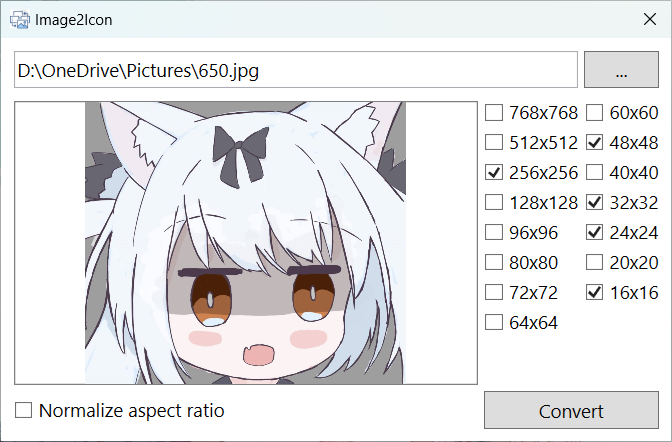

# Image2Icon

🌍 **[简体中文](README-CN.md) | [English](README.md)**

A tool developed using WPF that allows users to convert images of various formats into Windows Icon (.ico) files containing multiple sizes of images.

## Features

- Supports conversion of PNG, JPEG and other image files into Icon format.
- Allows users to choose all image sizes to include in the Icon file (256x256, 128x128, 96x96, 80x80, 72x72, 64x64, 60x60, 48x48, 40x40, 32x32, 24x24, 20x20, 16x16).

## System Requirements

- Windows 7 or higher
- .NET Framework 4.7.2 or higher

## Previews

## Release Note

The main archive only contains the native library for the x64 architecture, if you need to run it on x86 or Arm64 architectures, please download the corresponding native library and place it in the program directory.

## License

This project is licensed under the MIT License - see the [LICENSE](LICENSE.md) file for details.
